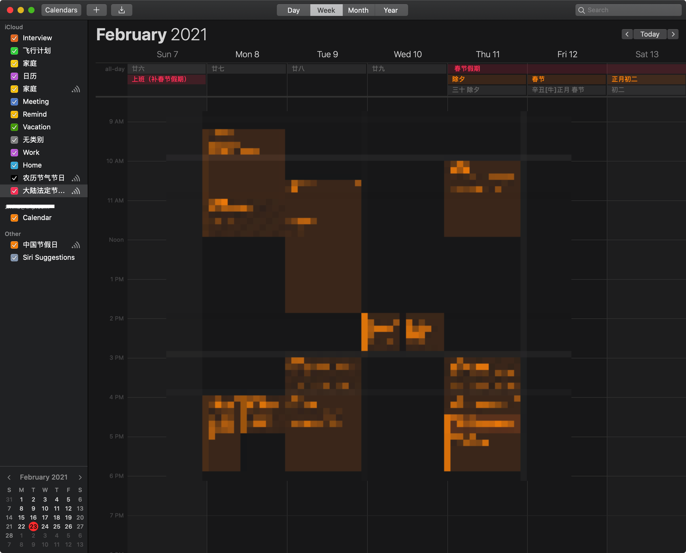

## MAC日历软件的介绍和选择
戴码使用过的认为比较好的日历APP有三个，下面一一介绍一下
- Calendar 系统自带
- Fantastical 要钱的 [官网](https://flexibits.com/fantastical)
- Itsycal 免费 [官网](https://www.mowglii.com/itsycal/)

视频地址：

### Calendar
- 订阅日历
- 中国节假日 https://p10-calendars.icloud.com/holiday/CN_zh.ics
- 中国台湾节假日 https://p10-calendars.icloud.com/holiday/TW_zh.ics
- 中国香港节假日 https://p10-calendars.icloud.com/holiday/HK_zh.ics
- 中国香港节假日（英文）https://p10-calendars.icloud.com/holiday/HK_en.ics
- 中国香港天文台提供的中国农历，节气，及传统节日 https://raw.github.com/infinet/lunar-calender/master/chinese_lunar_prev_year_next_year.ics
- 中国法定放假日 https://p42-calendars.icloud.com/published/2/FwgHV75qkmBJROFTOL4UajNB6kChgjvU3OXThGwApQRMHpPeshnDpxSwbQbKUDYpBXoSxIk7PsTa6EXyAjNVn-PvA0hfY5IWlXe_RIwbjvA

### Fantastical
- 完整的注册安装

### Itsycal
- 设置 icon
  - Catalina: E H:mm
  - big sur:

