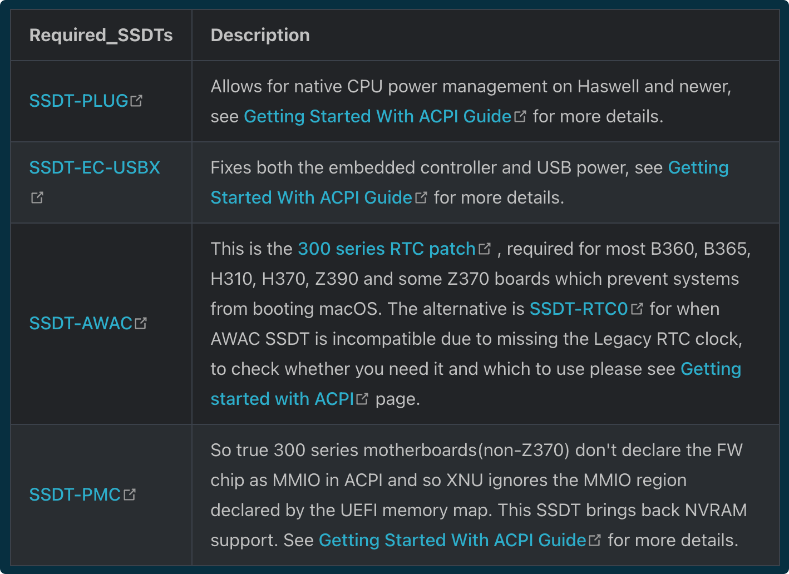
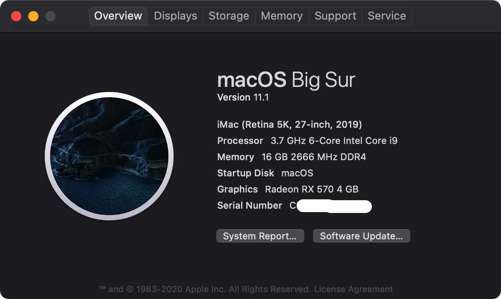
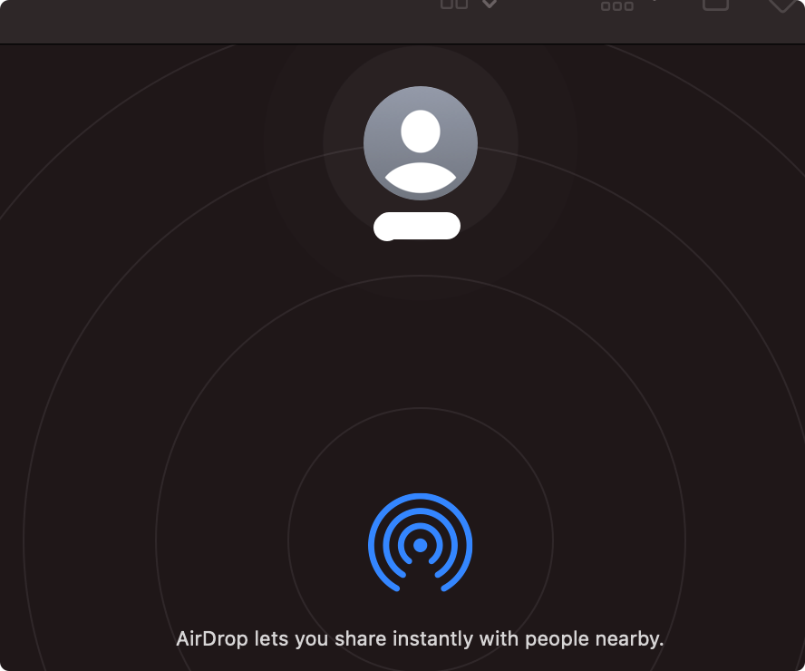

# 安装黑苹果教程

- [同步视频演示](https://www.youtube.com/watch?v=jSErmsLlRA0)
- 不能看Y站请移步[B站](https://www.bilibili.com/video/BV1xp4y1H7Ws/)
- FEI文件在这里 [https://github.com/mgeeker/HACKINTOSH-Z390-I-AORUS-PRO-WIFI-i5-9600K](https://github.com/mgeeker/HACKINTOSH-Z390-I-AORUS-PRO-WIFI-i5-9600K)

本文主要针对Intel Coffee Lake 平台的完美黑苹果系统安装教程，本文会详细讲解如何使用官方的MacOS Big Sur安装包自己创建启动U盘和定制本机的EFI文件（使用Gentoo的人貌似不来个make menuconfig晚上都睡不着。楼主家的open wrt都是make menuconfig，自己编译的固件。今天有了这台机器，以后升级固件就省事了）

### 参考资料
对于黑苹果的安装，楼主不是自己搞的，是参考以下教程的内容：
- [OpenCore Install Guide](https://dortania.github.io/OpenCore-Install-Guide/)

### 背景
因为需要一台Windows偶尔玩一下《微软模拟飞行2020》但是平时工作又在MacOS下，所以打算配一台itx小主机，装个Windows 10再黑个苹果。这样即满足工作需要，又满足娱乐需求。

### 硬件选择
关于黑苹果的硬件件选择可以参考:
* [GPU Buyers Guide](https://dortania.github.io/GPU-Buyers-Guide/#a-quick-refresher-with-nvidia-and-webdrivers)
* [Wireless Byers Guide](https://dortania.github.io/Wireless-Buyers-Guide/)
* [Anti Hardware Byers Guide](https://dortania.github.io/Anti-Hackintosh-Buyers-Guide/)

|  | 型号   | 价格   | URL| | 到货 |
| ---------- | -------------            | -------- | ---- | ---|---|
|CPU      | i5-9600K             | *      ||TB |√|
| 主板     | Z390 I AORUS PRO WIFI | *     |  | 闲鱼 | √|
| 显卡     | Sapphire Rx 570 白金  | *     | | 闲鱼|√|
| Wifi&BT | BCM94360CS2 + M.2转  | *     | | 闲鱼|√|
| 电源     | 酷冷至尊SFX750W    | *  | |PDD|√|
| 机箱     |GEEEK N501         |   * |  |TB|√|
| 内存     | 金斯顿16G3200  | * | | 闲鱼|√|
| 硬盘SATA     |  Gloway 1T          | *| | 闲鱼|√|
| 硬盘M.2     |  Gloway 1T          | *|  | JD |√|
| 散热器 | 水冷Dell AM4      | *||TB|√|
| 转换器 | - | *||TB|√|
| 风扇     | - | *||TB|√|

出于种种原因的考虑，楼主把价格都隐掉了。

注：主板上的wifi是Intel 9560NGW， 而且主板上的M.2的接口是纯的CNVi协议，一般不推荐买这样的主板，原因是无法安装苹果免驱的无线网卡)但是这么便宜的二手主板，楼主就下手了，况且戴码小哥哥这么喜欢ITX机箱:)

至于为什么这样选硬件，楼主不想多言了，要搞黑苹果不是什么硬件都能搞的，不是什么硬件都能搞的，不是什么硬件都能搞的，重要的事情说三遍~~~~

*硬盘当然是要支持国产咯:)*

买AM4的水冷散热是因为楼主买的机箱特别小，itx主板，大的风扇都放不进去，正常的水冷也装不进去（只有风扇是9CM的才能装），所以某宝买到一个AM4接口的，所以才需要转换器。再者9600K不买个水冷，我也不敢超啊~~

### 主板上加装BCM的Wifi & Bluetooth
- 一块M.2 NGFF的转接口
- 一块BCM94360CS的网卡（本来我想买BCM94360CS2的，可是商家发了一个这么个玩艺，还好最后驱动弄好了

这个是需要飞一根线到USB上的，不要飞错了，主板烧掉了就不好了，所以请在哪里买的咨询好商家如何接线
此解决方案虽然解决了Bluetooth的问题，但是占了我一个M.2的口，而且还是支持PCIe的……，真可惜，看来我的Windows 10只能装在SATA盘里了

### 安装准备
- 16GB的U盘，或是移动硬盘，建议是移动硬盘，这样写入速度比较快，省的等很久
- 一台Mac OS主机
- 支持的软件
  - [MountEFI](https://github.com/corpnewt/MountEFI)
  - [OpenCore-Configurator](https://github.com/notiflux/OpenCore-Configurator) --- [Download](https://mackie100projects.altervista.org/download-opencore-configurator/)
  - [OpenCorePkg](https://github.com/acidanthera/OpenCorePkg)
  - [ProperTree](https://github.com/corpnewt/ProperTree)

请全程参考[OpenCore Install Guide](https://dortania.github.io/OpenCore-Install-Guide/prerequisites.html)

### 制作EFI
- 下载 [OpenCorePkg](https://github.com/acidanthera/OpenCorePkg) 并复制出x64/EFI （仅针对UEFI引导的64位机器）

#### Drivers 
- OC/Driver 下保留
  - HfsPlus.efi 必选
  - OpenRuntime.efi 必选
#### Kexts
- [VirtualSMC](https://github.com/acidanthera/VirtualSMC/releases) 
  - VirtualSMC.kext
  - SMCProcessor.kext
  - SMCSuperIO.kext
- [Lilu](https://github.com/acidanthera/Lilu/releases)
  - Lilu.kext
#### Graphics
- [WhateverGreen](https://github.com/acidanthera/WhateverGreen/releases)
  - WhateverGreen.kext

#### Audio
- [AppleALC](https://github.com/acidanthera/AppleALC/releases)
  - AppleALC.kext

#### Ethernet
- [IntelMausi](https://github.com/acidanthera/IntelMausi/releases)
  - IntelMausi.kext

#### USB
- [USBInjectAll](https://bitbucket.org/RehabMan/os-x-usb-inject-all/downloads/) 
  - USBInjectAll.kext

#### WiFi and Bluetooth
- [AirportBrcmFixup](https://github.com/acidanthera/AirportBrcmFixup)
  - AirportBrcmFixup.kext
- [BrcmPatchRAM](https://github.com/acidanthera/BrcmPatchRAM)
  - BrcmBluetoothInjector.kext
  - BrcmFirmwareData.kext
  - BrcmPatchRAM3.kext

### ACPI配置

#### 什么是SSDT/DSDT
- DSDT: Differentiated System description Table Fields, 区分系统描述表字段，ACPI其中的一个表格
- SSDT: Secondary System Description Table Fields, 辅助系统描述字段， ACPI其中的一个表格

针对黑苹果所有的补丁都是通过SSDT来注入的，所以安装黑苹果创建符合黑苹果机的SSDT是尤其重要的

#### 什么是ACPI
- ACPI: Advanced Configuration & Power Interface 高级配置和电源接口，包含很多表格

#### 制作ACPI文件
- 先看看我们需要解决哪几个补丁

- 详细的直接看这个文档，照做就好了 [Getting Started With ACPI](https://dortania.github.io/Getting-Started-With-ACPI/)
- 下载[SSDT Time](https://github.com/corpnewt/SSDTTime) 
- 运行SSDTTime.bat

- 分别选4，3，2生成3个文件
- SSDT-PLUG.dsl 不必修改
- SSDT-EC.dsl 不必修改
- 搞定 [SSDT-AWAC/RTC0](https://dortania.github.io/Getting-Started-With-ACPI/Universal/awac-methods/manual.html#edits-to-the-sample-ssdt)
- 搞定 [SSDT-PMC](https://dortania.github.io/Getting-Started-With-ACPI/Universal/nvram-methods/manual.html#edits-to-the-sample-ssdt)
- 下载 [SSDT-USBX.aml](https://github.com/dortania/OpenCore-Post-Install/blob/master/extra-files/SSDT-USBX.aml) 这个不需要编译
- 制作好上述5个文件,编译成aml,工具可以使用： Windows[iasl.exe](https://acpica.org/downloads/binary-tools) , MacOS [MaciASL](https://github.com/acidanthera/MaciASL/releases)
- 具体怎么编译就不教了，如果这个都需要教，那放弃黑果吧
- 把编译完的文件 copy 到EFI的 ACPI目录里

#### 编辑config.list
- 文档在这里 [Config.list](https://dortania.github.io/OpenCore-Install-Guide/config.plist/coffee-lake.html#starting-point)
- 8，9代CPU选Coffee Lake 就照着做吧，太多了，写累了
- PlatformInfo选择 iMac19,1

### BIOS configration
- disable
	- Fast boot
	- CFG Lock (MSR 0xE2 write protection)
	- VT-d
	- CSM
	- Intel SGX
- enable
	- VT-x
	- Above 4G decoding
	- Hyper Threading
	- Execute Disable Bit
	- EHCI/XHCI Hand-off
	- OS type: Windows 8.1/10(将 操作系统类型设置为 Windows 8.1/10 是因为部分主板在 Other 模式下会将系统认作是 Windows 7 从而禁用 UEFI 的某些功能并开启 CSM, 200 系及以后的主板理论上不存在这个问题)
	- Legacy RTC Device

#### 制作 U盘 & 安装 MacOS Big Sur
- 下载 MacOS big sur，并制作启动U盘（U盘使用GPT分区，会自动分一个EFI分区，这个很重要）
  - 如果是苹果机：[官方](https://support.apple.com/zh-cn/HT201372)
  - 如果是Windows: [gibMacOS](https://github.com/corpnewt/gibMacOS)
- 通过MountEFI把你的U盘的EFI分区Mount进来，把EFI目录复制进去

好，到此，如果你之前的操作没有什么问题的话，你的U盘应该可以启动电脑安装了（电脑硬盘分区也是GPT，因为需要EFI分区）。。。在电脑安装重启之后，使用一个WINPE启动电脑，把U盘里的EFI分区COPY到硬盘的EFI分区里，再选择硬盘直接启动继续安装。。。

如果你使用的硬件和我的一样，那按照上述的操作，你的电脑应该可以完美黑。。。。

#### bootload的界面是不是太丑了，美化一下
- 文档在这里 [OpenCore beauty treatment](https://dortania.github.io/OpenCore-Post-Install/cosmetic/gui.html#setting-up-opencore-s-gui)

这样是不是好看很多

- About

- Bluetooth

- AirDrop
