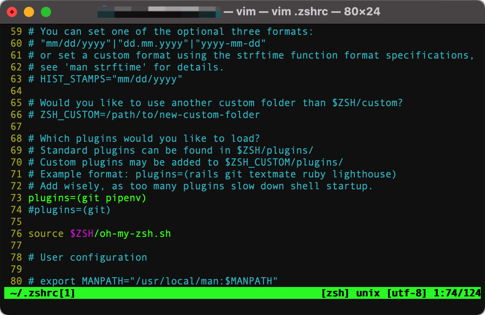
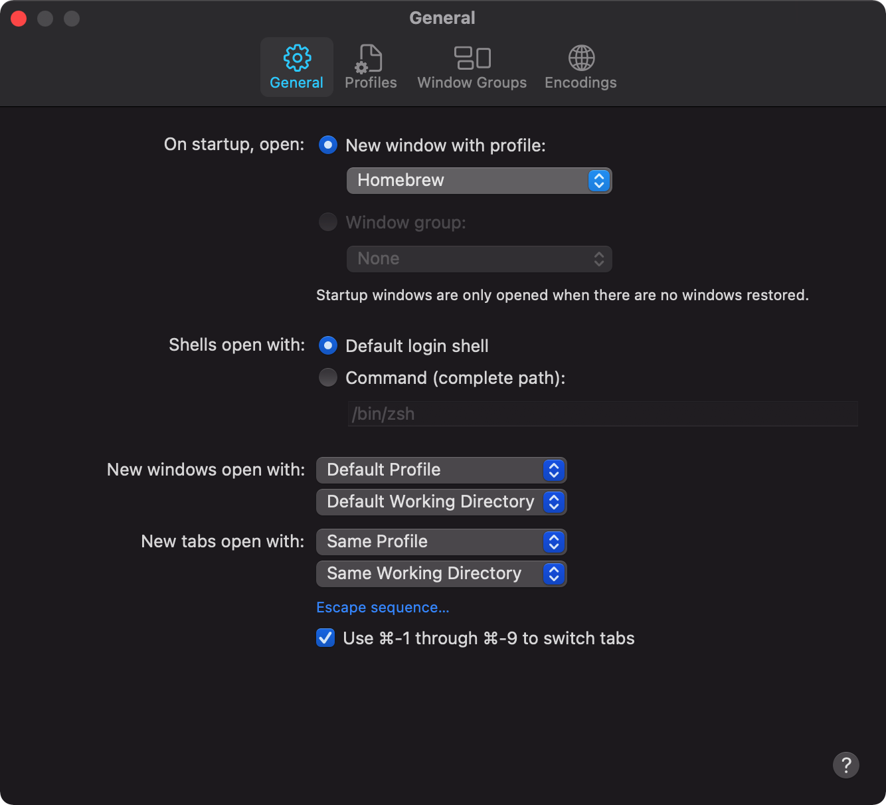

## Terminal

本集是给技术小哥哥或是小姐姐们看的，如果普通人，对命令行特别讨厌的就略过吧。

本期视频将介绍MacOS的Terminal高效的使用方法，初级水平。

我想这也是戴码喜欢MacOS的原因之一吧。

### 视频地址
- [Y站]()
- [B站]()

### oh-my-zsh

美化Terminal，美化应该是最重要的，没有之一吧:)
之前不知道为什么无脑的说oh my zsh是美化，我也是醉了，刚刚处理视频的时候听到了，唉！没有办法，只能这样了。
这里纠正一下，oh my zsh是对shell的一个很强大的扩展程序，没有美化功能:(

- [oh my zsh](https://ohmyz.sh/)

- 安装
```shell
sh -c "$(curl -fsSL https://raw.github.com/ohmyzsh/ohmyzsh/master/tools/install.sh)"
```
如图：


- 安装主题
    - [Themes](https://github.com/ohmyzsh/ohmyzsh/wiki/Themes)
    - 找到适合你的一款
    - 修改 ~/.zshrc 文件 中的ZSH_THEME="*your theme*"


- 安装插件
    - 插件地址：[github](https://github.com/ohmyzsh/ohmyzsh/tree/master/plugins)
    - 修改 ~/.zshrc 文件中的plugins=(....)
    - eg: 两个插件： git 和 pipenv就写成plugins=(git pipenv) 如下图


### homebrew

安装从Linux移植过来的软件
- 安装
```shell
/bin/bash -c "$(curl -fsSL https://raw.githubusercontent.com/Homebrew/install/HEAD/install.sh)"
```


- 把Terminal的profile改成homebrew，颜色方案更好




- 当然只要你喜欢，你可以换成任何profile，不影响你使用homebrew

- 更多的内容请参考[homebrew官网](https://brew.sh/)