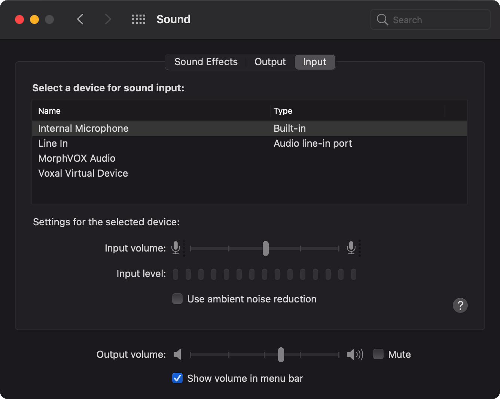
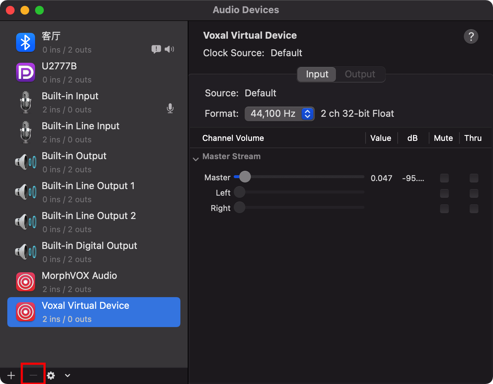

# MacOS 删除多余的输入输出设备

如果你的Mac在某个地方，不小心连了一些音频输出的设备，在系统里这些就一直存在
还有就是装了一些跟音频处理相关的app，最后你app卸载了，可是设备还在
在下图的位置，会影响你切换输入输出设备的



## 使用midi app 删除

这个APP的全称是Audio MIDI Setup.app
启动之后像这样子

看左下角有一个减号
没有用的设备可以通过这个减号删除
但是也有些删不掉删不掉删不掉删不掉……
所才就有以下比较复杂的方法了

## 进阶删除
查看三个目录
```shell
/Library/Extensions/
/System/Library/Extensions/
/Library/Audio/Plug-Ins/HAL/
```

比如Apowersoft_Audio Device，软件卸载后，在/System/Library/Extensions/目录下会残留一个Apowersoft_AudioDevice.kext
删除该文件，然后重启电脑，就能发现，该多余的音频设备就已经不存在了

比如 Voxal Virtual Device也是同样的，APP卸载了，可是设备还在，看着挺难受的

再比如Easy Connect Audio,软件卸载后，在/System/Library/Extensions/目录下会残留一个Antecea_AudioDiv.kext
删除该文件并重启后，就能删除该多余的输入输出设备了

反正根据你的需要，但是不要删错了，这些目录删错了比较危险~~~~~
所以建议先把你要删除的移动到用户目录里面，等重启系统，检查没有问题了，再删除：）

祝你好运 ~~~~~