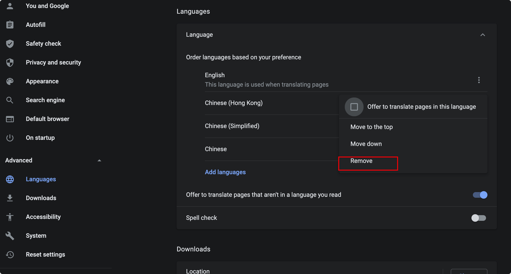

## 注册google帐号

开设这个频道，楼主就是想成为一个youtuber，至于为什么想要成为一个youtuber，以后会慢慢的告诉大家，这个频道将会向大家公开我在youtube上的一步一步的做法，把楼主的实践分享出来，楼主也是现学现卖，所以高手有什么想指导我的，欢迎给我留言~~~感谢~~~

### 中国大陆用户
很多中国大陆用户在注册google的 +86的手机号出现 “此号码无法用于验证” 的提示

解决这个问题，请跟随以下操作就好了，我亲试OK的
- 在你的Chrome settings -> Advanced -> Languages 删除掉除English之外的所有语言（你可以注册完成了之后加进去）

- 再去google.com上注册，现在顺利过关了吧

- 成功下一下

### 港澳台地区
- 貌似没有这样子的问题