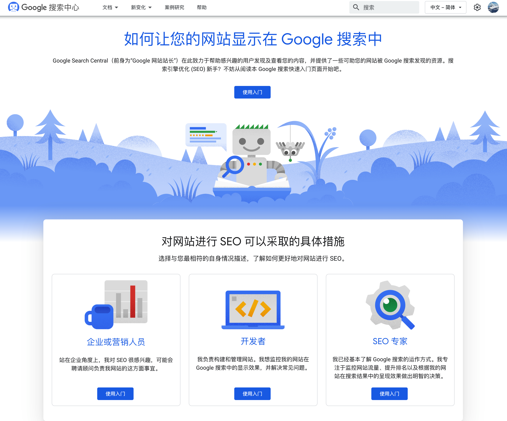

# 建立了一个网站给频道引流

### 申请域名
- godaddy
  最大的域名注册商，虽然是最大的，但是还是要黑一下，注册的时候是很便宜，优惠券啥的都能使用，可是续费的时候可没有这么好~~~~~

### 开设VPS
- VPS我选择的是：[bandwagon](https://bandwagonhost.com/aff.php?aff=64092)
  - 1.是比较便宜，云主机的厂商中他算是便宜的了
  - 2.他们科学上网的线路还是不错的。尤其是中国大陆的程序员小哥哥，要经常google，所以必备的
  - 我已经从VPS又搬到了github pages了，所以看个人喜好吧，不想给自己增加更多的麻烦，github还是方便了许多。

### 选择建站工具
- gitbook
  使用简单，布署简单，不需要DB，所以也不需要数据备份，因为静态文件都是通过markdown文件生成的，自己在github上开一个仓库，把markdown文件存那上面就好了，还有版本管理，多好~~~~
  选用gitbook还有一个好处，就是不必使用VPS，直接布署到github pages上，而且还支持自定义域名和https访问，也是绝了
- 写好你的文章
  ```shell
  gitbook build .
  ```
  编译好

  查看
  ```shell
  gitbook serve
  ```
- 生成sitemap.xml
- 提交到github pages(不想写了。。。到时候视频看吧！)

### 提交Google
- 注册[Google 搜索中心](https://developers.google.com/search)
  
- gitbook有插件支持的

### 接ga
- 申请ga
- gitbook增加插件

### gitbook plugins
```json
"plugins": [
        "gtag",
        "page-treeview",
        "expandable-chapters",
        "theme-comscore",
        "video",
        "chinese-video",
        "flexible-alerts",
        "code",
        "back-to-top-button",
        "page-footer"
    ]
```

关于这些插件的配置，大家可以自己去github上搜。 [Alfred](../macos/01-soft-alfred.md)这个视频里就讲过，不用打开浏览器就能搜的方法，自己可以实践一下。

### 提交Baidu
- 注册baidu帐号[这里](https://ziyuan.baidu.com/)
  
- 提交sitemap.xml

### 重点
- 这一套随时可以写内容的框架搭好了，剩下的工作就是一有空就写内容
- 周末有空就把内容录制成视频
- 在视频发布之前其实还有几件事情
- 第一件就是：需要制作一张视频的封面（也叫缩略图），我个人并不觉得视频的缩略图有那么的重要，但是大家都做，也做一下试试，不想浪费太多的时间，我能接受的只能是5-10分钟搞定，所以下一期我会专门讲一下如何高效的制作这个缩略图